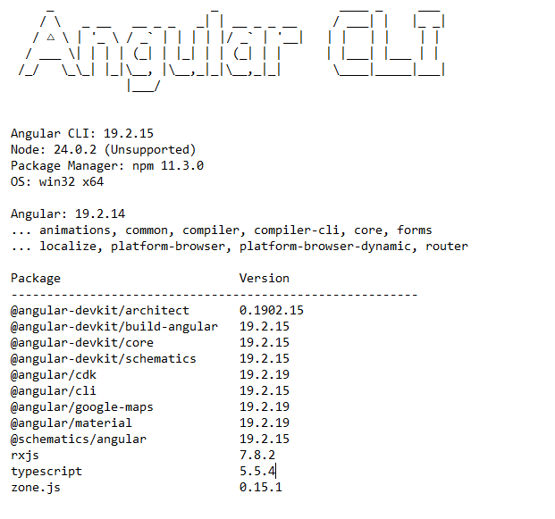

# 5GMETA Cloud Platform Dashboard

## Introduction

This project hosts the source code of the dashboard module of the 5GMETA platform.

The main objective of the dashboard is to provide a graphical interface to the data consumers allowing them to benefit from the 5GMETA platform features that are otherwise only accessible using API requests.

Its implementation is based on the Angular 14 framework.

## Prerequisites

To install Angular on a local system, the following requirements are needed:
- Node.js
    - Check the [version compatibility](https://angular.io/guide/versions).
    - More information on installing Node.js on its [official website](https://nodejs.org/).
- npm package manager
    - It should be installed with Node.js by default.
    - To verify, run `npm -v`

Versions used in dev :



## Features

### Identity management

The dashboard relies on the 5GMETA identity module which is based on Keycloak to authenticate users. Additionally, it uses the user management API to manage user business information. See [identity](https://github.com/5gmeta/identity).

### Data catalogue

The main objective of the data catalogue module is to allow the exploration of the referenced dataflows on the platform.

It relies on the OpenStreetMap API and the 5GMETA dataflow API.


### Subscription

The subscription module groups all the features allowing the management of the subscription to the dataflows.

It relies on the 5GMETA dataflow API, discovery API and cloudinstance API.


### Monitoring

The monitoring module is responsible of the presentation of the real-time data regarding the usage of the 5GMETA platform in particular the volume and cost of data consumption for the current user.

It relies on the 5GMETA platform metering features supported by Prometheus.


## Deployment

### Development version

To deploy a development version, the following commands are necessary:

```
cd src
npm install
npm start
```

Then open your browser and go to `http://localhost:4200`

### Production version

To deploy in production mode, the following steps needs to be followed:
- Build the application
    - `npm build`
    - A `dist` directory should be generated
- Deploy the application
    - Serve the `dist` folder content with a production web server
    - Precise instructions depend on the chosen web server
- Configure fall back to `index.html`
    - The procedure is dependent on the chosen web server, but examples of configuration are provided on the [official Angular website](https://angular.io/guide/deployment).
- Start the web server

## Authors

- Mejdi Ghorri
- Kamel Khenessi
- Mohamed Tarhouni
- Mandimby Ranaivo R.
- Wisal Mechi
- Theo Dupont
- Laeticia Calice
- Contact: 5gmeta@akkodis.com

## Conclusion and Roadmap

#TODO
